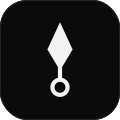
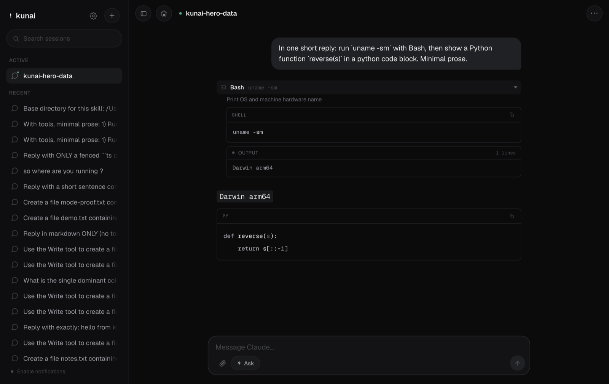

<div align="center">



# Kunai

**One app for Claude Code across every machine you own. Self-hosted, relay-free,
from your phone.**

Install Kunai on each machine you work on, then drive them all from a single app
over your Tailscale network. Your Linux boxes and your Mac show up side by side,
and you choose which one a session runs on. No cloud relay sits between you and
Claude, so every token takes the shortest path, and nothing but a generic push
notification ever leaves the tailnet.

<p>


</p>



</div>

## Why

Anthropic's Remote Control and similar third-party tools route every message
through a relay server before it reaches your machine, which adds a round trip on
top of Claude's own generation time. A Tailscale link between your devices is
direct peer to peer almost all of the time, so a client that talks straight over
that tunnel feels noticeably faster. Kunai's hard rule: the only thing that ever
leaves the tailnet is a content-free push wake-up.

It is a single Go binary. It wraps the `claude` CLI, serves an installable web app
(a PWA), and speaks to your devices directly over the tailnet.

## Highlights

- **A fleet, not one box.** This is the core idea. Run the same binary on every
  machine you use. One installed app aggregates their sessions and talks to each
  machine directly over the tailnet, with no traffic proxied through a middle
  server. The machine you install from is the hub; the rest are peers that are
  auto-discovered when they come online. You pick which machine a session runs on
  from the sidebar and the dashboard, and the home screen shows live stats for
  each one (memory, CPU, disk, uptime).
- **Rich chat.** Token streaming rendered as markdown, syntax-highlighted code
  with copy, real red and green diffs for file edits, and a card per tool that
  shows both the request and the output (command stdout, file contents, and
  errors), correlated to the tool call.
- **Approve and deny gate.** Every tool that needs permission is gated, with
  "always allow this session". The gate shows the actual diff or command you are
  approving. Permission modes: Ask, Auto, Accept edits, Plan.
- **Survives the phone.** Backgrounding kills the socket, not the session. On
  reconnect the client replays exactly what it missed. Past sessions resume with
  their full conversation and tool outputs restored.
- **On your terms.** Bound to the tailnet only, no login system, no accounts. File
  and image attachments, and Web Push that carries only a content-free wake-up.

## How it works

```
Phone / laptop (Svelte PWA)
    |  wss + REST, direct over Tailscale
    v
kunai (single Go binary, bound to the tailnet IP)
    /ws/app/:id      WebSocket bridge to the client
    session manager  per-session ring buffer, seq replay, permissions
    /api/*           sessions, history, stats, browse, upload, push, machines
    embedded PWA     served from the binary (go:embed)
    |  stdin/stdout stream-json, one process per session
    v
claude CLI (Claude Code)
```

Kunai drives Claude Code over its stream-json control protocol on stdin and
stdout, the same protocol the official Agent SDK uses. The tailnet is the entire
auth perimeter: the server binds to the Tailscale interface only, and Tailscale
ACLs decide who can reach it.

In a multi-machine setup, the machine you install the app from is the **hub** (it
owns the machine registry, Web Push, and peer discovery). Every other machine is a
**peer**. The client fetches the machine list from the hub, then connects directly
to each machine's tailnet origin, so no traffic is proxied and the relay-free
promise holds across the whole fleet.

## Get started

### Prerequisites

- A machine on your Tailscale tailnet (Linux or macOS).
- [Claude Code](https://claude.com/claude-code) installed and authenticated, with
  `claude` on your PATH.
- Tailscale with MagicDNS and HTTPS certificates enabled (admin console: DNS, then
  HTTPS Certificates).
- No toolchain needed to start: `install.sh` builds from source and
  auto-installs a local Go toolchain if `go` is missing (a self-contained
  download under `~/.kunai`, no root). The web app is prebuilt and embedded, so
  Node is not required.

### 1. Install on your main machine

One line, no toolchain — downloads a prebuilt binary and sets everything up:

```sh
curl -fsSL https://raw.githubusercontent.com/HEGADE/kunai/main/install.sh | bash
```

Or from a source checkout (builds from source, installing a local Go toolchain
automatically if `go` is missing):

```sh
git clone https://github.com/HEGADE/kunai && cd kunai
./install.sh
```

The installer does everything and prints the URL to open:

1. gets the binary (a prebuilt release, or a source build in a checkout),
2. detects your tailnet address and MagicDNS name,
3. mints a TLS certificate with `tailscale cert`,
4. installs a service (a systemd user unit on Linux, a launchd agent on macOS),
5. health-checks it and prints `https://<your-machine>.<tailnet>.ts.net:8443`.

**Updating** (Mac or Linux): just re-run the installer — the one-liner again, or
`./install.sh` in a checkout. It swaps the binary and restarts the service.

### 2. Open it on your phone

Open the printed URL. On iOS, use Safari, then Share, then Add to Home Screen, and
enable notifications from the installed app. That machine is now your **hub**.

### 3. Add more machines (optional)

Run the installer on any other machine, pointing it at your hub so its
notifications reach your phone:

```sh
curl -fsSL https://raw.githubusercontent.com/HEGADE/kunai/main/install.sh \
  | KUNAI_HUB_URL=https://<hub>.<tailnet>.ts.net:8443 bash
```

Open the hub's app and the new machine appears automatically. Pick which machine
to start a session on from the sidebar and dashboard.

## Configuration

Set with a flag or an environment variable.

| Flag          | Env                | Default          | Description                                        |
| ------------- | ------------------ | ---------------- | -------------------------------------------------- |
| `-addr`       | `KUNAI_ADDR`       | `127.0.0.1:8443` | Bind address (use the tailnet IP in production)    |
| `-tls-cert`   | `KUNAI_TLS_CERT`   |                  | TLS certificate (empty means plain HTTP, dev only) |
| `-tls-key`    | `KUNAI_TLS_KEY`    |                  | TLS key                                            |
| `-data`       | `KUNAI_DATA`       | `~/.kunai`       | VAPID keys, subscriptions, uploads, registry       |
| `-public-url` | `KUNAI_PUBLIC_URL` |                  | This machine's own tailnet origin                  |
| `-hub-url`    | `KUNAI_HUB_URL`    |                  | Hub origin to forward push to (set on peers)       |
| `-model`      | `KUNAI_MODEL`      |                  | Default model for new sessions                     |
| `-push-email` | `KUNAI_PUSH_EMAIL` |                  | VAPID contact for Web Push                         |

Installer overrides: `KUNAI_PORT` (default 8443), plus `KUNAI_HUB_URL` and
`KUNAI_PUSH_EMAIL`.

## Security

- Bind to the tailnet IP, never `0.0.0.0`. Tailscale ACLs are the perimeter.
- Anyone who can reach the server can run Claude Code in any directory the
  server's user can read. Treat access to the port as access to the machine.
- Cross-origin access is allowed only because the tailnet is the perimeter and the
  API uses no cookies or sessions. Do not add cookie auth without tightening it.
- Web Push is the single hop outside the tailnet (Apple and Google push services).
  The payload is a generic wake-up string, never content.
- TLS certificates from `tailscale cert` are not auto-renewed yet, so plan to
  re-mint them (roughly every 90 days).

## Build from source and develop

```sh
make build       # web app plus a local binary
make release     # cross-compiles linux and darwin (amd64 and arm64) into dist/
make deploy HOST=user@machine   # push a fresh linux build to a host and restart it

go test ./...            # backend tests
cd web && npm run check  # svelte-check and tsc
cd web && npm run dev    # frontend dev server
```

The web app is embedded into the binary with `go:embed`, so a frontend change
needs a web rebuild before the Go build:

```sh
cd web && npm run build && cd ..
go build -o kunai ./cmd/kunai
```

Manage the installed service with `systemctl --user status|restart kunai` and
`journalctl --user -u kunai -f` on Linux, or `launchctl` and `~/.kunai/kunai.log`
on macOS.

## Repository layout

```
cmd/kunai/          entrypoint: flags, TLS, server wiring
internal/claude/    stream-json driver for the claude CLI, including tool results
internal/session/   session lifecycle, ring buffer, seq replay, permissions
internal/server/    HTTP and WebSocket API, history, stats, uploads, machines, discovery, push
internal/push/      Web Push (VAPID) keys, subscriptions, wake-ups
internal/fsbrowse/  directory listing for the project picker
internal/webui/     embedded production build of the web app
web/                Svelte 5 and Vite PWA source
```

The `claude` stream-json protocol is undocumented. The closest reference is the
type definitions shipped with `@anthropic-ai/claude-agent-sdk`. Kunai keeps every
protocol type in `internal/claude` so a CLI change stays a one-file fix.

## Contributing

Issues and pull requests are welcome. A few house rules:

- The frontend build in `internal/webui/dist` is committed and embedded, so
  rebuild the web app before the Go binary when you change the frontend.
- Run `go test ./...` and `cd web && npm run check` before opening a PR.
- No emojis or em dashes in commit messages or docs.

## License

[MIT](LICENSE).
